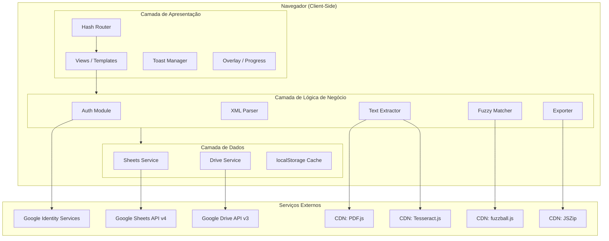
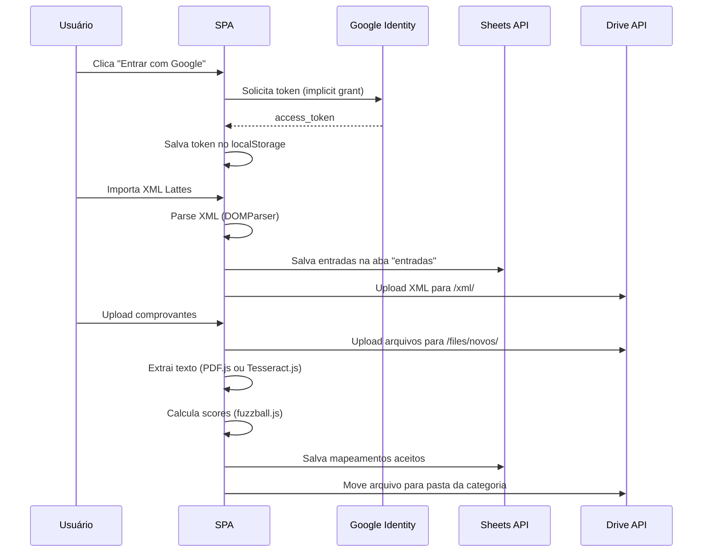

# Design Document — ComprovaLattes

## Overview

O ComprovaLattes é uma Single Page Application (SPA) estática hospedada no GitHub Pages que gerencia e associa comprovantes acadêmicos às entradas extraídas do XML do Currículo Lattes (CNPq). A aplicação não possui backend — todo processamento (parsing XML, extração de texto via PDF.js/Tesseract.js, fuzzy matching via fuzzball.js, exportação ZIP via JSZip) ocorre client-side no navegador.

A arquitetura segue o padrão de módulos ES com separação clara entre camadas: autenticação (Google Identity Services), persistência (Google Sheets API v4), armazenamento de arquivos (Google Drive API v3), processamento de texto (PDF.js + Tesseract.js), matching (fuzzball.js) e interface (vanilla HTML/CSS/JS com hash routing).

### Decisões Arquiteturais Chave

| Decisão | Racional |
|---------|----------|
| OAuth2 implicit grant (GIS token model) | Única opção viável para sites estáticos no GitHub Pages sem backend |
| Google Sheets como banco de dados | Elimina necessidade de servidor; dados consultáveis pelo usuário fora da app |
| Processamento client-side (PDF.js, Tesseract.js) | Sem backend disponível; reduz latência e custos |
| Bibliotecas via CDN com fallback local | Requisito do projeto; simplifica deploy. Se CDN falhar, a aplicação carrega cópias locais dos scripts (pasta `lib/`) |
| Hash routing (#view) | Compatível com sites estáticos sem server-side routing |
| localStorage para cache/sessão | Fallback imediato para operações offline e persistência de token |

---

## Architecture

### Diagrama de Arquitetura de Alto Nível



### Fluxo de Dados Principal



### Estratégia de Comunicação com APIs

Todas as chamadas às APIs do Google são feitas via `fetch()` com o token OAuth2 no header `Authorization: Bearer {token}`. Não é utilizado o cliente JavaScript do Google (gapi.client) para manter a aplicação leve e sem dependência adicional.

**Rate Limiting**: As APIs do Google possuem cotas. A aplicação implementa:
- Retry exponencial com jitter para erros 429 e 5xx
- Batch de operações no Sheets (até 100 linhas por request via `spreadsheets.values.batchUpdate`)
- Processamento sequencial de uploads (um arquivo por vez para evitar burst)

**CDN com Fallback Local**: Todas as bibliotecas externas são carregadas preferencialmente via CDN. Caso o CDN não responda (erro de rede ou timeout de 5 segundos), a aplicação carrega automaticamente as cópias locais da pasta `lib/`. O padrão de carregamento é:

```html
<script src="https://cdn.example.com/lib.min.js"
        onerror="this.src='lib/lib.min.js'"></script>
```

---

## Components and Interfaces

### Módulos JavaScript

```
index.html              — Ponto de entrada, carrega CDNs (com fallback local) e módulos
lib/                    — Cópias locais das bibliotecas CDN (fallback)
  pdf.min.js
  pdf.worker.min.js
  tesseract.min.js
  fuzzball.umd.min.js
  jszip.min.js
css/
  styles.css            — Estilos globais, custom properties, responsividade
js/
  app.js                — Bootstrap, inicialização, hash router
  auth.js               — Autenticação OAuth2 (GIS)
  config.js             — Gerenciamento de configurações
  router.js             — Hash routing e lifecycle de views
  
  services/
    sheets.js           — CRUD Google Sheets API v4
    drive.js            — CRUD Google Drive API v3
    
  core/
    xml-parser.js       — Parse XML Lattes, extração de entradas
    text-extractor.js   — Extração de texto (PDF.js + Tesseract.js)
    matcher.js          — Fuzzy matching (fuzzball.js Token Set Ratio)
    exporter.js         — Exportação organizada (Drive + JSZip)
    category-manager.js — Gerenciamento de categorias e visibilidade
    entry-manager.js    — Gerenciamento de entradas e mapeamentos
    
  views/
    login.js            — View de login
    dashboard.js        — Dashboard de progresso
    entries.js          — Listagem e associação manual
    import.js           — Importação XML e upload comprovantes
    review.js           — Revisão de sugestões (overlay fullscreen)
    hidden.js           — Itens ocultos
    settings.js         — Configurações
    
  ui/
    toast.js            — Sistema de notificações toast
    overlay.js          — Overlays com spinner e progresso
    progress-bar.js     — Componente de barra de progresso
```

### Interfaces dos Módulos Principais

#### `auth.js` — Módulo de Autenticação

```javascript
/**
 * Inicializa o Google Identity Services e configura callbacks.
 * @param {Object} config - { clientId: string, scopes: string[] }
 * @returns {void}
 */
function initAuth(config) {}

/**
 * Inicia o fluxo OAuth2 implicit grant.
 * @returns {Promise<string>} access_token
 */
function signIn() {}

/**
 * Revoga o token e limpa o localStorage.
 * @returns {Promise<void>}
 */
function signOut() {}

/**
 * Verifica validade do token armazenado.
 * @returns {Promise<boolean>}
 */
function validateToken() {}

/**
 * Retorna o token ativo ou null.
 * @returns {string|null}
 */
function getToken() {}
```

#### `services/sheets.js` — Serviço Google Sheets

```javascript
/**
 * Lê todas as linhas de uma aba.
 * @param {string} spreadsheetId
 * @param {string} sheetName
 * @returns {Promise<Array<Object>>} rows como objetos {coluna: valor}
 */
function getRows(spreadsheetId, sheetName) {}

/**
 * Adiciona linhas no final de uma aba.
 * @param {string} spreadsheetId
 * @param {string} sheetName
 * @param {Array<Array<string>>} rows
 * @returns {Promise<void>}
 */
function appendRows(spreadsheetId, sheetName, rows) {}

/**
 * Atualiza uma linha específica por índice.
 * @param {string} spreadsheetId
 * @param {string} sheetName
 * @param {number} rowIndex — 1-based (header = 1)
 * @param {Object} data — { coluna: valor }
 * @returns {Promise<void>}
 */
function updateRow(spreadsheetId, sheetName, rowIndex, data) {}

/**
 * Atualiza múltiplas linhas em batch.
 * @param {string} spreadsheetId
 * @param {Array<{range: string, values: Array}>} updates
 * @returns {Promise<void>}
 */
function batchUpdate(spreadsheetId, updates) {}

/**
 * Cria uma planilha nova com abas e headers definidos.
 * @param {string} title
 * @param {Array<{name: string, headers: string[]}>} sheets
 * @returns {Promise<string>} spreadsheetId criado
 */
function createSpreadsheet(title, sheets) {}
```

#### `services/drive.js` — Serviço Google Drive

```javascript
/**
 * Busca pasta por nome dentro de um parent.
 * @param {string} name
 * @param {string} parentId — 'root' para raiz
 * @returns {Promise<string|null>} folderId ou null
 */
function findFolder(name, parentId) {}

/**
 * Cria pasta no Drive.
 * @param {string} name
 * @param {string} parentId
 * @returns {Promise<string>} folderId
 */
function createFolder(name, parentId) {}

/**
 * Faz upload de arquivo para uma pasta.
 * @param {File} file — File API object
 * @param {string} folderId
 * @param {string} [fileName] — nome opcional (usa file.name se omitido)
 * @returns {Promise<{id: string, name: string}>}
 */
function uploadFile(file, folderId, fileName) {}

/**
 * Move arquivo entre pastas.
 * @param {string} fileId
 * @param {string} fromFolderId
 * @param {string} toFolderId
 * @returns {Promise<void>}
 */
function moveFile(fileId, fromFolderId, toFolderId) {}

/**
 * Renomeia arquivo.
 * @param {string} fileId
 * @param {string} newName
 * @returns {Promise<void>}
 */
function renameFile(fileId, newName) {}

/**
 * Lista arquivos em uma pasta.
 * @param {string} folderId
 * @returns {Promise<Array<{id: string, name: string, mimeType: string}>>}
 */
function listFiles(folderId) {}

/**
 * Obtém conteúdo binário de um arquivo (para PDF.js/Tesseract).
 * @param {string} fileId
 * @returns {Promise<ArrayBuffer>}
 */
function downloadFile(fileId) {}

/**
 * Exclui um arquivo permanentemente.
 * @param {string} fileId
 * @returns {Promise<void>}
 */
function deleteFile(fileId) {}
```

#### `core/xml-parser.js` — Parser XML Lattes

```javascript
/**
 * Parseia o XML Lattes e extrai entradas acadêmicas.
 * @param {string} xmlContent — conteúdo bruto do XML
 * @returns {ParseResult}
 * 
 * @typedef {Object} ParseResult
 * @property {LattesEntry[]} entries
 * @property {Category[]} categories
 * @property {string[]} errors — avisos de parsing
 */
function parseXml(xmlContent) {}

/**
 * Converte nome de seção XML para nome legível em pt-BR.
 * @param {string} xmlSectionName — ex: "FORMACAO-COMPLEMENTAR-CURSO-DE-CURTA-DURACAO"
 * @returns {string} — ex: "Formação Complementar — Curso de Curta Duração"
 */
function formatCategoryName(xmlSectionName) {}

/**
 * Gera slug a partir do nome XML da categoria.
 * @param {string} xmlSectionName
 * @returns {string} — ex: "formacao-complementar-curso-de-curta-duracao"
 */
function categorySlug(xmlSectionName) {}
```

#### `core/text-extractor.js` — Extração de Texto

```javascript
/**
 * Extrai texto de um arquivo PDF usando PDF.js.
 * @param {ArrayBuffer} pdfData
 * @returns {Promise<string>} texto extraído concatenado
 */
function extractFromPdf(pdfData) {}

/**
 * Extrai texto de uma imagem usando Tesseract.js (OCR, lang: por).
 * @param {Blob|ArrayBuffer} imageData
 * @returns {Promise<string>} texto reconhecido
 */
function extractFromImage(imageData) {}

/**
 * Detecta tipo do arquivo e despacha para extrator correto.
 * @param {ArrayBuffer} fileData
 * @param {string} mimeType
 * @returns {Promise<string>} texto extraído
 */
function extractText(fileData, mimeType) {}
```

#### `core/matcher.js` — Fuzzy Matching

```javascript
/**
 * Calcula score de confiança entre texto extraído e uma entrada.
 * @param {string} extractedText — texto do comprovante
 * @param {LattesEntry} entry — entrada Lattes
 * @returns {number} score 0–100
 * 
 * Fórmula:
 *   título (55%, Token Set Ratio) +
 *   instituição (30%, Token Set Ratio) +
 *   ano (10%, match exato ±1) +
 *   carga horária (5%, tolerância ±20%)
 */
function calculateScore(extractedText, entry) {}

/**
 * Executa auto-match: encontra a melhor entrada para um comprovante.
 * @param {string} extractedText
 * @param {LattesEntry[]} candidates — entradas ativas, visíveis, não mapeadas
 * @param {number} threshold — 0–100, padrão 50
 * @returns {MatchResult}
 * 
 * @typedef {Object} MatchResult
 * @property {'auto_accepted'|'review'|'no_match'} status
 * @property {LattesEntry|null} bestMatch
 * @property {number} score
 * @property {boolean} hasTie — true se empate no score máximo
 */
function findBestMatch(extractedText, candidates, threshold) {}

/**
 * Encontra o trecho do texto extraído com maior similaridade ao título.
 * @param {string} text — texto completo
 * @param {string} reference — título/instituição de referência
 * @param {number} maxChars — máximo de caracteres (padrão 500)
 * @returns {{snippet: string, highlightWords: string[]}}
 */
function findBestSnippet(text, reference, maxChars) {}
```

#### `core/exporter.js` — Exportação

```javascript
/**
 * Exporta arquivos mapeados para pasta organizada no Drive.
 * @param {MappedEntry[]} entries — entradas com comprovantes associados
 * @param {Object} config — { rootFolderId, categories }
 * @param {function} onProgress — callback(current, total)
 * @returns {Promise<ExportResult>}
 * 
 * @typedef {Object} ExportResult
 * @property {number} success
 * @property {number} failed
 * @property {string[]} errors
 */
function exportToDrive(entries, config, onProgress) {}

/**
 * Gera ZIP com arquivos organizados para download local.
 * @param {MappedEntry[]} entries
 * @param {function} onProgress
 * @returns {Promise<Blob>} ZIP como Blob
 */
function exportToZip(entries, onProgress) {}

/**
 * Gera nome de arquivo padronizado para exportação.
 * @param {LattesEntry} entry
 * @param {string} extension
 * @returns {string} — max 200 chars, ASCII-safe
 */
function formatExportFileName(entry, extension) {}
```

---

## Data Models

### Entidades Principais

```javascript
/**
 * @typedef {Object} LattesEntry
 * @property {string} id — UUID gerado no import
 * @property {string} titulo
 * @property {string} instituicao
 * @property {string} ano — "2021" ou ""
 * @property {string} carga_horaria — "40" ou ""
 * @property {string} categoria — referência ao id da categoria
 * @property {'pendente'|'mapeada'|'removida'|'mantida_manual'} status
 * @property {boolean} oculta
 * @property {string|null} arquivo_drive_id
 * @property {string|null} arquivo_nome
 * @property {number|null} confianca — 0–100
 * @property {string|null} data_mapeamento — ISO 8601 (YYYY-MM-DD)
 */

/**
 * @typedef {Object} Category
 * @property {string} id — UUID
 * @property {string} nome_xml — "FORMACAO-COMPLEMENTAR-CURSO-DE-CURTA-DURACAO"
 * @property {string} nome_display — "Formação Complementar — Curso de Curta Duração"
 * @property {boolean} ativa
 * @property {string|null} pasta_drive_id
 */

/**
 * @typedef {Object} AppConfig
 * @property {number} threshold — 0–100, padrão 50
 * @property {string|null} spreadsheet_id
 * @property {string|null} root_folder_id
 */

/**
 * @typedef {Object} ReviewItem
 * @property {string} fileId — Google Drive file ID
 * @property {string} fileName
 * @property {LattesEntry} suggestedEntry
 * @property {number} score
 * @property {string} extractedText
 * @property {string} snippet
 * @property {string[]} highlightWords
 */
```

### Esquema Google Sheets

**Aba "entradas"** (header na linha 1):

| Coluna | Tipo | Descrição |
|--------|------|-----------|
| id | string | UUID v4 |
| titulo | string | Título da atividade |
| instituicao | string | Nome da instituição |
| ano | string | Ano (4 dígitos ou vazio) |
| carga_horaria | string | Horas (número ou vazio) |
| categoria | string | ID da categoria |
| status | enum | pendente / mapeada / removida / mantida_manual |
| oculta | boolean | TRUE / FALSE |
| arquivo_drive_id | string | ID do arquivo no Drive ou vazio |
| arquivo_nome | string | Nome do arquivo ou vazio |
| confianca | number | 0–100 ou vazio |
| data_mapeamento | string | YYYY-MM-DD ou vazio |

**Aba "categorias"** (header na linha 1):

| Coluna | Tipo | Descrição |
|--------|------|-----------|
| id | string | UUID v4 |
| nome_xml | string | Nome original do XML |
| nome_display | string | Nome formatado em pt-BR |
| ativa | boolean | TRUE / FALSE |
| pasta_drive_id | string | ID da pasta no Drive ou vazio |

**Aba "config"** (header na linha 1):

| Coluna | Tipo | Descrição |
|--------|------|-----------|
| chave | string | Nome da configuração (único) |
| valor | string | Valor serializado |

### Estrutura de Pastas no Google Drive

```
ComprovaLattes/                     ← Pasta raiz
├── files/
│   ├── novos/                      ← Comprovantes ainda não associados
│   ├── formacao-complementar/      ← Pasta por categoria (slug)
│   ├── participacao-em-eventos/
│   └── ...
├── xml/                            ← XMLs importados
└── exportacao/                     ← Saída da exportação organizada
    ├── 2.1 Formação Complementar/
    ├── 3.1 Participação em Eventos/
    └── ...
```

---


## Correctness Properties

*A property is a characteristic or behavior that should hold true across all valid executions of a system — essentially, a formal statement about what the system should do. Properties serve as the bridge between human-readable specifications and machine-verifiable correctness guarantees.*

### Property 1: XML Parsing Produces Complete Structured Entries

*For any* valid Lattes XML containing N entries across M distinct sections, parsing the XML SHALL produce exactly N `LattesEntry` objects and M `Category` objects, where each entry has non-null `titulo`, `instituicao`, `ano`, `carga_horaria`, and `categoria` fields (using empty string for absent attributes), and each category is initialized with `ativa = false`.

**Validates: Requirements 2.2, 2.4, 2.5, 2.6**

### Property 2: Category Name Formatting Preserves Readability

*For any* XML section name in the format "WORD1-WORD2-...-WORDN" (uppercase, hyphen-separated), `formatCategoryName` SHALL produce a string where: each word is title-cased, hyphens between major sections are replaced by " — " (em dash with spaces), hyphens within sub-sections are replaced by spaces, and Portuguese diacritics are restored for known words (e.g., "FORMACAO" → "Formação", "PARTICIPACAO" → "Participação").

**Validates: Requirements 2.10**

### Property 3: Reimportation Merge Preserves Existing Mappings

*For any* set of existing entries (some with mapeamentos) and a new XML with overlapping and non-overlapping entries, the merge SHALL: (a) preserve all existing mapeamentos for entries present in both old and new sets (matched by titulo+instituicao+ano+categoria), (b) add new entries with status "pendente", and (c) mark entries absent from the new XML as status "removida" without deleting their data.

**Validates: Requirements 2.8, 16.1**

### Property 4: Score Calculation Bounds and Weight Consistency

*For any* extracted text string and any `LattesEntry`, `calculateScore` SHALL return a value in the range [0, 100]. Furthermore, *for any* extracted text that is identical to the entry's título, the título component (55% weight) SHALL contribute its maximum value; and *for any* text where the entry's year appears within ±1, the year component (10% weight) SHALL contribute its maximum value.

**Validates: Requirements 4.3**

### Property 5: Match Classification Follows Decision Tree

*For any* extracted text, set of candidate entries, and threshold value: (a) if the best score ≥ 99% with no tie, `findBestMatch` SHALL return status "auto_accepted"; (b) if the best score ≥ 99% with a tie, SHALL return status "review"; (c) if the best score < 99% and ≥ threshold, SHALL return status "review"; (d) if all scores < threshold, SHALL return status "no_match".

**Validates: Requirements 4.5, 4.6, 4.7**

### Property 6: Visibility Filtering Invariant

*For any* set of entries and categories, the visible entry set SHALL contain only entries where: the entry's category has `ativa = true` AND the entry's `oculta = false` AND the entry's status is NOT "removida" (unless "mantida_manual"). No entry violating any of these conditions SHALL appear in matching candidates, progress calculations, or user-visible listings.

**Validates: Requirements 4.4, 6.2, 6.4, 7.1**

### Property 7: Visibility Toggle Round-Trip

*For any* category that is active with visible entries, toggling the category OFF then ON SHALL restore exactly the set of entries that were visible before (excluding any individually hidden entries). *For any* individually hidden entry, unhiding it SHALL restore it to visible listings if its category is active.

**Validates: Requirements 6.6, 6.10**

### Property 8: Export File Name Format Compliance

*For any* `LattesEntry` with arbitrary título, instituição, ano, and categoria, `formatExportFileName` SHALL produce a string that: (a) is at most 200 characters, (b) contains only ASCII-safe characters (no accents, no special filesystem characters), (c) follows the pattern "ANO_tipo_INSTITUICAO_Titulo.ext", and (d) for the same entry, always produces the same output (deterministic).

**Validates: Requirements 5.9, 9.3**

### Property 9: Entry Filtering and Search Correctness

*For any* set of visible entries and a search query of 2+ characters, the filtered result SHALL contain only entries where the query appears as a case-insensitive substring in either `titulo` or `instituicao`. *For any* combination of category, year, and status filters, only entries matching ALL active filter criteria SHALL be included in results.

**Validates: Requirements 7.3, 7.4**

### Property 10: Progress Calculation Correctness

*For any* set of entries and categories, the global progress SHALL equal (count of entries with status "mapeada" or "mantida_manual" that are visible) divided by (total visible entries), expressed as a percentage. Per-category progress SHALL apply the same formula restricted to entries of that category. When the denominator is zero, progress SHALL be 0%.

**Validates: Requirements 8.1, 8.2, 8.3, 8.5**

### Property 11: Configuration Conflict Resolution

*For any* state where localStorage contains config values that differ from the values in the "config" sheet of the Planilha, after initialization the application SHALL use the Planilha values as authoritative and update localStorage to match.

**Validates: Requirements 10.9**

---

## Error Handling

### Estratégia Geral

A aplicação adota uma abordagem defensiva com degradação graciosa:

| Camada | Estratégia | Exemplo |
|--------|-----------|---------|
| Rede/API | Retry exponencial (3 tentativas, backoff 1s/2s/4s + jitter) | Chamadas Sheets/Drive |
| Autenticação | Fallback para tela de login | Token expirado/inválido |
| Parsing | Tolerância a campos ausentes (string vazia) | Atributos XML faltantes |
| Upload/Export | Continuar batch mesmo com falhas individuais | Arquivo corrompido |
| Persistência | localStorage como fallback do Sheets | Config sync falha |
| UI | Toast + rollback de estado visual | Operação rejeitada pela API |

### Padrões de Erro por Módulo

**Autenticação (auth.js)**:
- Token expirado → Limpa localStorage, redireciona para login
- Permissões negadas → Mensagem informativa, permanece na tela de login
- Revogação falha (rede) → Limpa dados locais mesmo assim (fail-safe)

**Google Sheets (sheets.js)**:
- 401 Unauthorized → Trigger refresh de token ou logout
- 429 Too Many Requests → Retry com backoff exponencial
- 403 Forbidden → Mensagem "planilha inacessível", campo editável para correção
- Aba/coluna ausente → Auto-repair: recria estrutura preservando dados

**Google Drive (drive.js)**:
- Upload falha → Toast com nome do arquivo, continua com próximos
- Move/rename falha → Toast, mantém arquivo na posição original, não altera mapeamento
- Pasta não encontrada → Recria automaticamente

**Extração de Texto (text-extractor.js)**:
- PDF.js falha (PDF protegido, corrompido) → Registra como "não processado", toast
- Tesseract.js falha (imagem ilegível) → Mesmo tratamento
- Texto vazio extraído → Tratado como falha de extração

**Matching (matcher.js)**:
- Sem candidatos elegíveis → Retorna "no_match" silenciosamente
- Empate no score máximo → Encaminha para revisão em vez de auto-aceitar

### Feedback ao Usuário

- **Toast de sucesso** (verde): 4 segundos, auto-dismiss
- **Toast de erro** (vermelho): 5 segundos, dismiss manual disponível
- **Toast de info** (azul): 4 segundos, auto-dismiss
- **Overlay bloqueante**: Operações longas (import, export, upload batch)
- **Rollback visual**: Toggles revertidos se persistência falhar

---

## Testing Strategy

### Abordagem Dual: Testes Unitários + Testes de Propriedade

A estratégia de teste combina:
1. **Testes de propriedade (PBT)** — Verificam invariantes universais com 100+ inputs gerados aleatoriamente
2. **Testes unitários** — Cobrem exemplos específicos, edge cases e integrações mockadas
3. **Testes de integração** — Validam interação com APIs do Google (mocked)

### Biblioteca de Property-Based Testing

**Biblioteca escolhida**: [fast-check](https://github.com/dubzzz/fast-check) (carregado via CDN com fallback local na pasta `lib/` para testes, ou via script tag em test runner HTML)

Justificativa: fast-check é a biblioteca de PBT mais madura para JavaScript, com suporte a shrinking, reprodutibilidade de falhas e ampla variedade de arbitraries (geradores).

Como o projeto não usa npm, os testes podem ser executados usando um HTML test runner dedicado com fast-check via CDN, ou opcionalmente via um `test/` directory com um runner simples.

### Configuração de Testes de Propriedade

- **Mínimo 100 iterações** por propriedade
- Cada teste anotado com: `// Feature: comprova-lattes, Property N: {título}`
- Seed fixável para reprodutibilidade
- Geradores customizados para:
  - XML Lattes válido (com número variável de seções e entradas)
  - Texto extraído (com ruído, OCR-like)
  - Nomes de categoria XML
  - Entradas com estados variados

### Mapeamento de Propriedades para Testes

| Property | Módulo Testado | Gerador Principal |
|----------|---------------|-------------------|
| 1: XML Parsing | xml-parser.js | XML com N entradas, M categorias |
| 2: Category Name Format | xml-parser.js | Strings UPPER-HYPHEN |
| 3: Reimportation Merge | entry-manager.js | Pares (entries existentes, XML novo) |
| 4: Score Calculation | matcher.js | Pares (texto, LattesEntry) |
| 5: Match Classification | matcher.js | (texto, candidatos[], threshold) |
| 6: Visibility Filtering | category-manager.js | (entries[], categories[], estados) |
| 7: Visibility Round-Trip | category-manager.js | (categoria, toggle OFF, toggle ON) |
| 8: File Name Format | exporter.js | LattesEntry com campos arbitrários |
| 9: Filtering/Search | entries.js | (entries[], query, filtros) |
| 10: Progress Calculation | dashboard.js | (entries[] com estados variados) |
| 11: Config Resolution | config.js | (localStorage values, Sheets values) |

### Testes Unitários (Exemplos e Edge Cases)

- **Auth**: Token armazenado/removido corretamente, redirect após login/logout
- **XML Parser**: Arquivo inválido rejeitado, codificação ISO-8859-1 tratada
- **Upload**: Toast de erro em falha, batch continua após falha individual
- **Revisão**: Fila manipulada corretamente (aceitar/rejeitar/pular/desistir)
- **Routing**: Hash inválido redireciona para dashboard, guard de autenticação

### Testes de Integração (Mocked APIs)

- Sheets API: CRUD de entradas, criação de planilha, auto-repair de schema
- Drive API: Upload, move, rename, delete, listagem de pastas
- Pipeline completo: Upload → Extração → Matching → Mapeamento

### Estrutura de Testes

```
test/
  test-runner.html        — HTML runner com fast-check via CDN
  properties/
    xml-parser.prop.js    — Properties 1, 2
    matcher.prop.js       — Properties 4, 5
    entry-manager.prop.js — Properties 3, 6, 7
    exporter.prop.js      — Property 8
    entries.prop.js       — Property 9
    dashboard.prop.js     — Property 10
    config.prop.js        — Property 11
  unit/
    auth.test.js
    sheets.test.js
    drive.test.js
    review.test.js
    router.test.js
  generators/
    lattes-xml.gen.js     — Gerador de XML Lattes válido
    entries.gen.js        — Gerador de LattesEntry
    text.gen.js           — Gerador de texto extraído (OCR-like)
```
